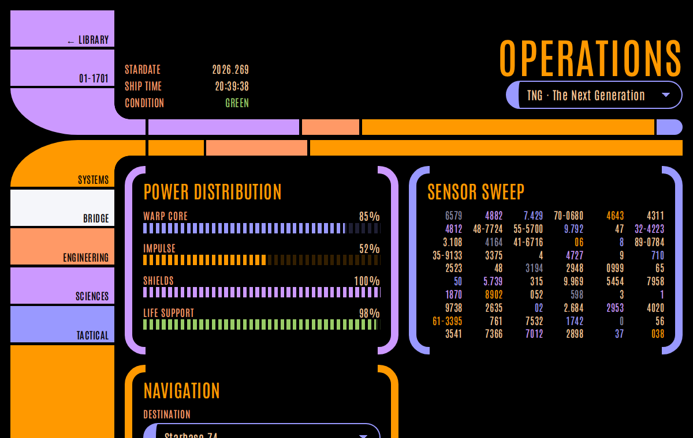

# LCARS

A framework-agnostic **LCARS design system** for building Star Trek–style web apps. It ships as plain CSS classes and design tokens, plus an optional ~9 kB JS helper, so it works with static HTML, React, Vue, Svelte, server-rendered templates or anything else that outputs HTML.



- **The real LCARS frame:** sidebars, elbows with concave inner fillets, and segmented bars, drawn in pure CSS with no images or masks.
- **Tokens all the way down.** Colors, sizes, radii and type are CSS custom properties. Re-skin the whole system by overriding a few variables.
- **One color hook.** Every colored piece reads `--lcars-c`, so `.lcars-c-violet` recolors a block, button, elbow, bracket, meter or table the same way.
- **A theme for every series:** TOS, SNW, DIS, ENT, TNG, DS9, VOY, the TNG films, Lower Decks, Prodigy and Picard, plus red alert. Some themes also change the frame geometry to match their era. A theme can apply to the whole page or to a single subtree.
- **Cascade layers.** The framework lives in `@layer lcars.*`, so any unlayered CSS of yours beats it without `!important` or specificity fights.
- **Incremental adoption.** Components work anywhere, and page typography only applies inside `.lcars`.
- **Accessible defaults:** visible focus rings, `aria-current`/`aria-pressed` states, `role="meter"` support, and animations that respect `prefers-reduced-motion`.

**Live references:** `examples/index.html` (component library with source for every demo), `examples/dashboard.html` (a full app), `examples/recipes/` (common patterns), `examples/starter.html` (a copy-paste template). Run `npm run dev` to browse them.

## For AI models and coding agents

The documentation is generated from the source, so it always matches the code. Point your assistant at one of these:

| File | Contents |
| --- | --- |
| [`llms-full.txt`](llms-full.txt) | Everything in one file: rules, common mistakes, "which component do I need", the complete reference and every recipe. |
| [`llms.txt`](llms.txt) | Short index in the [llms.txt](https://llmstxt.org) format. |
| [`docs/reference.md`](docs/reference.md) | Every class, token, theme, data attribute and JS function. |
| [`docs/recipes.md`](docs/recipes.md) | Copy-paste markup: app shell, header, sidebar nav, dashboard tiles, section heading, data table, form, tabs, dialog. |
| [`dist/lcars.manifest.json`](dist/lcars.manifest.json) | The same API as JSON. |
| [`AGENTS.md`](AGENTS.md) | How agents should use the framework, and how to change this repo. |

For example, in another project: *"Build the UI with the LCARS framework. Follow https://raw.githubusercontent.com/janos97/lcars/master/llms-full.txt."* Tests make sure every CSS class is documented and every documented class exists.

---

## Install

**CDN.** Pin to a tag or commit for production:

```html
<link rel="stylesheet" href="https://cdn.jsdelivr.net/gh/janos97/lcars@main/dist/lcars.min.css">
<script type="module" src="https://cdn.jsdelivr.net/gh/janos97/lcars@main/dist/lcars.js"></script> <!-- optional -->
```

**npm (from GitHub).** `dist/` is committed, so no build step is needed:

```sh
npm install github:janos97/lcars
```

```js
import "lcars/lcars.css";   // or "lcars/lcars.min.css"
import "lcars/lcars.js";    // optional helpers; safe to import during SSR
```

**Copy.** Drop `dist/` into your project. Keep `dist/fonts/` next to `lcars.css`.

## Five-minute tour

```html
<html class="lcars">            <!-- page typography + black background -->
<body>
  <div class="lcars-app">       <!-- full-height column of frames -->

    <header class="lcars-frame">                       <!-- header: elbow at the bottom -->
      <div class="lcars-frame__side">
        <div class="lcars-block lcars-grow lcars-c-secondary">LCARS</div>
      </div>
      <div class="lcars-frame__main"><h1 class="lcars-title">Engineering</h1></div>
      <div class="lcars-frame__elbow-bottom lcars-c-secondary"></div>
      <div class="lcars-frame__bar-bottom">
        <span class="lcars-block lcars-grow-3 lcars-c-secondary"></span>
        <span class="lcars-block lcars-c-primary lcars-round-end"></span>
      </div>
    </header>

    <div class="lcars-frame">                          <!-- body: elbow at the top -->
      <div class="lcars-frame__elbow-top">Systems</div>
      <div class="lcars-frame__bar-top">
        <span class="lcars-block lcars-grow-2"></span>
        <span class="lcars-block lcars-c-accent"></span>
      </div>
      <nav class="lcars-frame__side">
        <a class="lcars-block lcars-c-accent" href="/" aria-current="page">Home</a>
        <a class="lcars-block lcars-c-tertiary" href="/logs">Logs</a>
        <div class="lcars-block lcars-grow"></div>     <!-- filler down to the next elbow -->
      </nav>
      <main class="lcars-frame__main">…your app…</main>
    </div>

  </div>
</body>
</html>
```

Three ideas carry the whole system:

1. **`.lcars` is the page scope.** It sets the background, font, text color and heading styles. Put it on `<html>` for a full LCARS app, or on one wrapper to embed LCARS inside an existing site. Components work outside it too.
2. **`--lcars-c` is the color of a piece.** Components set a default, and `.lcars-c-<name>` or an inline `style="--lcars-c: #f0c"` overrides it. Text on colored pieces uses `--lcars-on-c` (black).
3. **The frame is a grid of optional parts.** Leave out the bottom pieces for a body frame, the top pieces for a header, or keep both for a bracket-shaped panel.

## The frame

```
┌───────────╮  ▀▀▀▀▀▀▀ ▀▀▀▀▀▀▀▀▀▀▀▀▀▀▀   .lcars-frame__bar-top
│ elbow-top │╭
├───────────┤│  .lcars-frame__main
│   side    ││
├───────────┤│
│ elbow-    │╰
└─ bottom ──╯  ▄▄▄▄▄▄▄ ▄▄▄▄▄▄▄▄▄▄▄▄▄▄▄   .lcars-frame__bar-bottom
```

| Part | Notes |
| --- | --- |
| `.lcars-frame` | Grid container. Sets the default `--lcars-c` for its elbows. |
| `.lcars-frame--right` | Mirrors the frame so the sidebar sits on the right. |
| `__elbow-top` / `__elbow-bottom` | The curved corner. It can be a `<div>`, `<a>` or `<button>`, and its optional label sits against the bar. The arm and inner fillet are drawn automatically. |
| `__bar-top` / `__bar-bottom` | A `.lcars-bar`. It starts after the elbow's arm. |
| `__side` | Vertical stack of `.lcars-block`s. Add `.lcars-grow` to a block to fill the remaining height. |
| `__main` | Your content. |

The geometry is controlled by tokens: `--lcars-side` (sidebar width, fluid by default), `--lcars-bar` (bar thickness), `--lcars-elbow-height`, `--lcars-elbow-reach`, `--lcars-elbow-rx` (outer curve), `--lcars-inner-radius` (fillet) and `--lcars-gap`. Set them on `:root` or on a single frame.

## Components

| Class | What it is | Modifiers / notes |
| --- | --- | --- |
| `.lcars-block` | Solid colored slab with its label in the bottom-right corner. Use it for sidebar items and bar segments. Works on `div`, `a` or `button`. | `--short` `--tall` `--top` `--start` `--center` |
| `.lcars-button` | Pill button. | `--sm` `--lg` `--block` `--center`, plus the shape utilities |
| `.lcars-addon` | Black number plate inside a button or block. | |
| `.lcars-bar` | Row of segments separated by gaps. | `--thin` `--thick`. Children: any `.lcars-block`, `.lcars-bar__title`, `.lcars-bar__fixed` |
| `.lcars-bracket` | Content between rounded `[ ]` brackets; the LCARS card. | `--start` `--end`. Vars: `--lcars-bracket-width`, `--lcars-bracket-arm` |
| `.lcars-title` | Big right-aligned display heading. | |
| `.lcars-label` | Small uppercase caption. | |
| `.lcars-pill` | Status tag. | `--outline` |
| `.lcars-list` | List with block-shaped bullets. | Color each `li` with `.lcars-c-*` |
| `.lcars-meter` | Segmented level bar. Set `--lcars-value` (0–1), or `aria-valuenow` when `lcars.js` is loaded. | `--solid` `--round` `--vertical` |
| `.lcars-data` | Dense grid of numbers. Add `data-lcars-cascade="N"` to generate and animate it. | `--lcars-data-cols` |
| `.lcars-readout` | `<dl>` of key/value pairs. | |
| `.lcars-table` | Data table with colored header rule and row caps. | `.lcars-num` for numeric cells |
| `.lcars-field` | Label, control and hint, stacked. | `.lcars-hint` |
| `.lcars-input` | `input`, `select` or `textarea`. | `aria-invalid="true"` switches it to the alert color |
| `.lcars-check` / `.lcars-switch` / `.lcars-range` | Checkbox or radio, toggle switch, and slider. | Wrap in `.lcars-choice` to pair with text |
| `.lcars-dialog` | Native `<dialog>` styled as a modal. Open with `showModal()`. | `--lcars-dialog-width` |
| `.lcars-svg` | Inline SVG whose shapes take `.lcars-c-*` colors and themes; shapes with `role="button"` act as controls. | See the `svg-control` recipe |

**Layout:** `.lcars-app` (full-page column of frames; the last one grows), `.lcars-stack`, `.lcars-cluster`, `.lcars-split`, `.lcars-grid` (auto-fit; tune with `--lcars-grid-min`), and `.lcars-span-all`. They all space with `--lcars-space`.

**Utilities:**

| Group | Classes |
| --- | --- |
| Color | `.lcars-c-{swatch or role}`, `.lcars-text-{swatch or role}` |
| Shape | `.lcars-round`, `.lcars-round-start`, `.lcars-round-end`, `.lcars-square` |
| Flex | `.lcars-grow`, `.lcars-grow-{0,2,3,4,6,8}` |
| Text | `.lcars-upper`, `.lcars-num`, `.lcars-text-start`, `.lcars-text-center`, `.lcars-text-end` |
| Motion | `.lcars-pulse`, `.lcars-blink` |
| Overflow | `.lcars-scroll` (wrap wide tables; add `tabindex="0"`) |
| Accessibility | `.lcars-sr-only` |

**States:** `aria-current`, `aria-pressed="true"`, `aria-selected="true"` and `.is-active` all switch a block or button to `--lcars-active`. `disabled` and `aria-disabled="true"` dim it.

## Colors and theming

**Swatches:** `orange gold butterscotch peach sunflower violet lilac pink magenta blue sky ice moonlight green red mars tomato gray white`, available as `--lcars-<name>`.

**Roles:** `primary secondary tertiary accent muted alert active`, plus `--lcars-bg`, `--lcars-fg`, `--lcars-on-c`, `--lcars-heading`, `--lcars-link` and `--lcars-focus`.

Use the role classes (`lcars-c-primary`, `-secondary`, `-tertiary`, `-accent`, `-muted`, `-alert`) for your UI chrome so it follows the theme. Use swatch classes only for colors that must stay fixed, such as `lcars-c-green` for "nominal".

| Theme id | Series | Look |
| --- | --- | --- |
| `tng` (default) | The Next Generation | Orange, violet, periwinkle |
| `tos` | The Original Series | Command gold, science blue, operations red; squarer corners |
| `snw` | Strange New Worlds | Retro-modern gold, teal, red |
| `dis` | Discovery | Silver-blue with delta gold; thin bars |
| `ent` | Enterprise | Gunmetal, steel blue, amber; near-square corners |
| `ds9` | Deep Space Nine | Rust, tan, dusty lavender |
| `voy` | Voyager | Peach, gold, blue-lilac |
| `nemesis` | TNG films (First Contact to Nemesis) | Sovereign-class blues and greys |
| `ld` | Lower Decks | Bright, high contrast |
| `pro` | Prodigy | Violet, teal, orange |
| `pic` | Picard | Slate blue, teal, amber; slimmer bars |
| `red-alert` | Condition red | Everything red, including the swatches |

The colors are fan interpretations, tuned so black text on colored pieces stays readable. They are not screen-accurate reproductions. Apply a theme to the page or to any subtree:

```html
<html class="lcars" data-lcars-theme="ds9">
<section data-lcars-theme="pic">…</section>
```

**Your own theme.** Define the roles under a new name, and optionally some geometry:

```css
[data-lcars-theme="borg"] {
  --lcars-bg: #000;
  --lcars-fg: #b6ffb0;
  --lcars-primary: #33cc66;
  --lcars-secondary: #88aa88;
  --lcars-tertiary: #66ff99;
  --lcars-accent: #ccff66;
  --lcars-muted: #557755;
  --lcars-alert: #ff4444;
  --lcars-active: #ffffff;
  --lcars-heading: #33cc66;
  --lcars-link: #ccff66;
  --lcars-inner-radius: 0.25rem;
}
```

**Global tweaks.** Override tokens on `:root`, for example `--lcars-font`, `--lcars-case: none` for mixed-case headings, `--lcars-gap`, `--lcars-bar` or `--lcars-side`.

> Roles are resolved where they are declared. If you change a swatch such as `--lcars-orange` on a subtree, also redeclare the roles that use it on that same element.

## JavaScript helpers (optional)

`dist/lcars.js` is a dependency-free ES module. When it loads, it initialises the page and watches for elements added later, so it works with SPAs. To initialise manually, add `data-lcars-manual` to `<html>` and call `LCARS.init(el)` yourself.

| Attribute | Effect |
| --- | --- |
| `data-lcars-clock` | Live 24 h clock. Use `="hm"` to drop the seconds. |
| `data-lcars-stardate` | Today's stardate as `YYYY.DDD`. |
| `data-lcars-cascade="48"` | Fills a `.lcars-data` grid with numbers and animates it. |
| `data-lcars-set-theme="ds9"` | Switches theme on click. `""` restores the default. |
| `data-lcars-theme-select` | On a `<select>`: fills itself with every theme and switches on change. |
| `data-lcars-toggle-alert` | Toggles red alert on click. |
| `data-lcars-sound[="tap\|confirm\|deny\|alert\|red-alert\|ready"]` | On an ancestor: clicks on interactive children play a sound (entering red alert plays `red-alert`). Use `data-lcars-tone` on a child to override it. |
| `.lcars-meter[aria-valuenow]` | Keeps `--lcars-value` in sync with the ARIA attributes. |

```js
import LCARS from "lcars/lcars.js";     // also exposed as window.LCARS
LCARS.setTheme("voy");                   // (id, element = <html>); ids in LCARS.THEMES
LCARS.setAlert(true);                    // red alert; setAlert() toggles
LCARS.beep("confirm");                   // tap | confirm | deny | alert | red-alert | ready
LCARS.setSounds({ "red-alert": "/sfx/klaxon.ogg" }); // optional: your own audio files
LCARS.init(someElement);                 // upgrade content you rendered
LCARS.stardate(); LCARS.clock();         // pure helpers
// Events: "lcars:theme" and "lcars:alert" bubble from the element that changed.
```

## Using it with a framework

It is just classes, so use `class`/`className` as usual. For example, in React:

```jsx
import "lcars/lcars.css";
import "lcars/lcars.js";

export function Sidebar({ items, current }) {
  return (
    <nav className="lcars-frame__side">
      {items.map((item) => (
        <a key={item.href} href={item.href}
           className={`lcars-block lcars-c-${item.color}`}
           aria-current={item.href === current ? "page" : undefined}>
          {item.label}
        </a>
      ))}
      <div className="lcars-block lcars-grow" />
    </nav>
  );
}
```

- **Tailwind or other utility CSS.** Load LCARS first. Its layers come before Tailwind's, so Tailwind utilities win. Reuse the tokens with arbitrary values such as `bg-[var(--lcars-orange)]`, or map them in Tailwind v4's `@theme`.
- **Sass, PostCSS or another bundler.** Import the source partials under `lcars/src/css/…` if you only want some layers, such as tokens and the frame.

## Browser support

Current evergreen browsers: Chrome/Edge 111+, Firefox 121+ and Safari 16.4+. The build targets those versions with [lightningcss](https://lightningcss.dev).

## Development

```sh
npm install
npm run dev     # http://localhost:4747/examples/ with rebuild-on-save
npm run build   # src/ → dist/
npm test        # generated files fresh, every class documented, tokens/themes, contrast, class usage, JS
npm run test:e2e  # Playwright: every example page — errors, overflow, geometry, themes, states, JS, axe a11y
```

```
src/css/lcars.css        entry: layer order + imports
src/css/tokens.css       palette, roles, type, geometry
src/css/themes.css       data-lcars-theme blocks
src/css/base.css         .lcars page scope
src/css/layout.css       app shell + stack/cluster/grid
src/css/frame.css        sidebar/elbow/bar frame
src/css/components/      block, button, bar, bracket, typography, meter, data, table, form, dialog
src/css/utilities.css    color, shape, flex, motion, a11y, states
src/js/lcars.js          optional helpers (+ THEMES catalogue)
src/meta/api.mjs         component/utility/JS descriptions, rules, mistakes → docs
src/recipes/             copy-paste patterns → docs + examples/recipes/
src/fonts/               Antonio (OFL)
scripts/                 build.mjs (CSS + docs), docs.mjs (generator), dev.mjs
dist/                    built output + lcars.manifest.json (generated, committed)
docs/, llms.txt, llms-full.txt, examples/recipes/   generated docs (committed)
examples/                library, dashboard, starter
```

Generated files are committed so the CDN, git installs and AI tools can read them directly. Run `npm run build` before you commit; the test suite fails if any generated file is stale. See [`AGENTS.md`](AGENTS.md) for the conventions.

## Credits and legal

- This is a fork of [Garrett-/lcars](https://github.com/Garrett-/lcars) (MIT). The original concept and code are by Garrett-; the 2020 upstream rewrite is by Jörn Weißenborn, with audio and SVG work by Justin Warwick and fixes by xenziffen (see `AUTHORS` and `LICENSE`). This fork is a fresh implementation; from upstream it adapts the semantic sound events and the SVG control (geometry of the X/Y widget) into its own architecture.
- Sounds are synthesized in the browser; no audio recordings are bundled. Use `LCARS.setSounds()` with audio you have the rights to.
- The [Antonio](https://github.com/googlefonts/antonioFont) typeface is bundled under the SIL Open Font License 1.1 (`src/fonts/OFL.txt`).
- LCARS and Star Trek are trademarks of CBS Studios / Paramount. This is an unofficial fan project, not affiliated with or endorsed by them.
